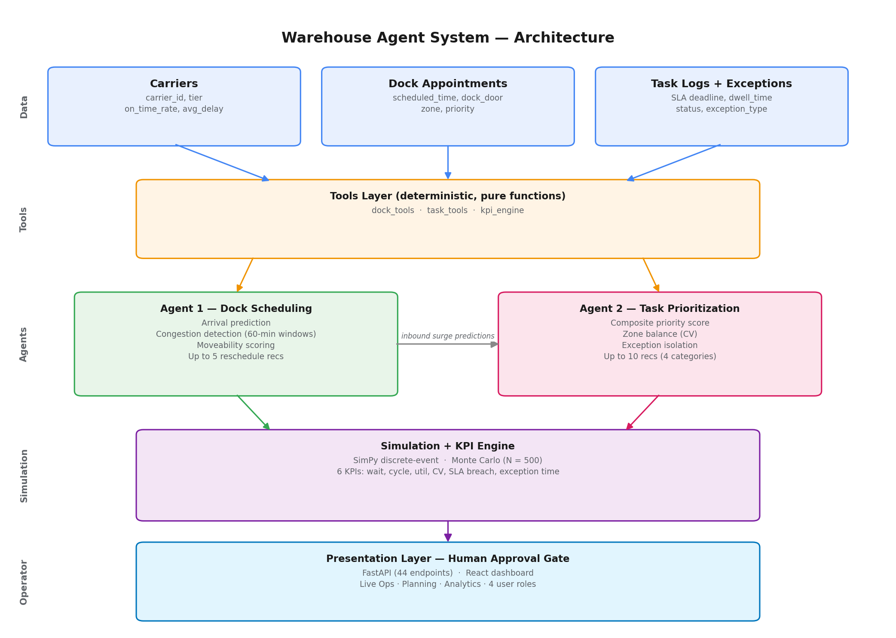

# Warehouse Agent System

An agentic AI decision support system for warehouse inbound operations. Two cooperating agents — a Dock Scheduling Agent and a Task Prioritization Agent — analyze operational state, predict bottlenecks, and recommend specific actions to operators. Every recommendation requires explicit human approval before any change is recorded.

UIC IDS 560 Capstone · Group 7 · Sponsored by Tredence Analytics · April 2026

---

## What it does

The system addresses two coupled warehouse problems: dock congestion (too many trucks at the dock at the same time) and task prioritization (which warehouse work to do next across overloaded zones). Agent 1 detects congestion windows and recommends rescheduling. Agent 2 scores and reorders the pending task queue, isolates exception tasks, and pre-clears zones for predicted inbound surges. A SimPy discrete-event simulator wrapped in 500-trial Monte Carlo validates each recommendation set against six operational KPIs.

The system runs on 89 days of synthetic data calibrated against real distribution-center patterns, with four designed stress-test scenarios that each exercise a distinct failure mode.

## Quick start

```bash
git clone https://github.com/SyedSobanShahid/warehouse-agent-system.git
cd warehouse-agent-system
docker compose up
```

Backend at `http://localhost:8000`, frontend at `http://localhost:3000`.

For local development without Docker, see [`docs/HANDOVER.md`](docs/HANDOVER.md).

## Demo walkthrough

Open the dashboard, set the role to "Manager," and use the date picker to step through these scenarios:

| Date | Scenario | Watch for |
|------|----------|-----------|
| 2026-04-14 | Congestion | Live Ops shows 240% peak occupancy; Planning tab has 5 reschedule recommendations |
| 2026-04-15 | Zone imbalance | Zone workload panel shows Zone A overloaded vs Zone C underloaded; CV = 1.30 |
| 2026-04-16 | Exception storm | All four zones flagged high-impact; 7 critical tasks in queue |
| 2026-04-17 | Inbound surge | Surge card shows Zones A and B at 15:00 with 6 shipments each |

## Architecture



Four logical layers communicate sequentially:

1. **Data layer** — seven CSV tables (carriers, dock appointments, shipment history, task logs, exception logs, daily KPI snapshots, wave plans) plus a SQLite audit trail.
2. **Tools layer** — pure deterministic functions for schedule analysis, congestion detection, queue scoring, exception isolation, and KPI computation.
3. **Agent layer** — two agents (rule-based or LLM-wrapped) coordinated by an orchestrator that passes Agent 1's inbound predictions to Agent 2.
4. **Presentation layer** — FastAPI service with 44 REST endpoints, React dashboard with live operations, planning, and analytics views, role-based access for Supervisor/Manager/Executive/Admin.

## Documentation

| Document | Purpose |
|----------|---------|
| [docs/HANDOVER.md](docs/HANDOVER.md) | Runbook: install, configure, troubleshoot |
| [docs/LOGIC_AND_ASSUMPTIONS.docx](docs/LOGIC_AND_ASSUMPTIONS.docx) | Every threshold, weight, and assumption with rationale |
| [docs/METHODOLOGY.docx](docs/METHODOLOGY.docx) | Formal methodology section from the paper |
| [docs/PATCHES_APPLIED.md](docs/PATCHES_APPLIED.md) | Engineering audit log: 24 issues found and fixed |
| [paper/](paper/) | Final research paper |

## Tech stack

**Backend:** Python 3.11, FastAPI 0.115, pandas 2.2, scikit-learn 1.5, XGBoost 2.1, SimPy 4.1, Pydantic 2.9
**Frontend:** React 19, Vite, Recharts, TanStack Query, Zustand
**LLM (optional):** OpenAI gpt-4o, Anthropic claude-sonnet-4-5
**Storage:** SQLite (audit log), CSV (operational data)

## Known limitations

- Advisory only — no Warehouse Management System write-back. Acceptance writes to an audit log.
- Synthetic data evaluation; real-world generalization not yet tested.
- Two of four supplementary ML models (wait time, task completion) gated as experimental because R² falls below the 0.30 production threshold.
- Multi-warehouse profiles (Atlanta, Dallas) are derived from Chicago via KPI multipliers; real deployment requires per-site datasets.
- Priority scoring reference time is hardcoded to 14:00; production deployment should use wall-clock time.

See the Logic and Assumptions document, Section 17, for the full list.

## Team

| Member | Email | LinkedIn |
|--------|-------|----------|
| Mike Irish-Ryan | mike52601@gmail.com | [michael-irish-ryan](https://www.linkedin.com/in/michael-irish-ryan-15160820a) |
| Narmeen Mahmood | narmeenmahmood99@gmail.com | [narmeen-mahmood](https://www.linkedin.com/in/narmeen-mahmood-47a90853) |
| Hesley Masara | hmasara04@gmail.com | [hesley-masara](https://www.linkedin.com/in/hesley-masara) |
| Syed Soban Shahid | sobanshahid97@gmail.com | [soban-shahid](https://www.linkedin.com/in/soban-shahid/) |
| Shu-Hui Sung | sophie.sh.sung@gmail.com | [shuhuisung](https://www.linkedin.com/in/shuhuisung) |
| Nhou Xiong | xiongnhou93@gmail.com | [nhouxiong](https://www.linkedin.com/in/nhouxiong) |

University of Illinois Chicago · IDS 560 Capstone, Spring 2026

## License

Released for academic and evaluation purposes. Contact the team or UIC IDS 560 program for commercial use inquiries.
